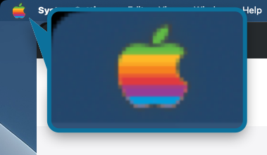

# RainbowApple

A tiny macOS utility that replaces the grey Apple logo in the menu bar with the classic six-colour rainbow Apple logo from 1977.



## Requirements

- macOS 14 (Sonoma) or later

## Installation

Two formats on every release — both signed and notarised, pick whichever suits:

- **[Installer (`.pkg`)](https://github.com/PerpetualBeta/RainbowApple/releases/latest/download/RainbowApple.pkg)** — recommended for first-time installs. Double-click to run; macOS Installer places the app in `/Applications` without quarantine or App Translocation.
- **[Download (`.zip`)](https://github.com/PerpetualBeta/RainbowApple/releases/latest)** — unzip and drag `RainbowApple.app` to your Applications folder.

Or install it with [Homebrew](https://brew.sh):

```sh
brew install --cask perpetualbeta/jorvik/rainbowapple
```

After installation, launch RainbowApple — the rainbow Apple logo appears over the system Apple icon in the menu bar.


## How It Works

RainbowApple places a small transparent window precisely over the system Apple logo in the top-left corner of the menu bar. The window renders the Apple logo glyph filled with the original six-colour rainbow stripes:

| Stripe | Colour | Hex |
|--------|--------|-----|
| 1 (top) | Green | #61BB46 |
| 2 | Yellow | #FDB827 |
| 3 | Orange | #F5821F |
| 4 | Red | #E03A3E |
| 5 | Purple | #963D97 |
| 6 (bottom) | Blue | #009DDC |

Each band is exactly a sixth of the apple's own height, and the leaf carries the top band's green in full — the arrangement of the 1977 original. The leaf sits above the fruit, so measuring the bands across the whole glyph instead would spend the entire green band on the leaf and leave the apple's shoulder yellow.

The overlay is click-through — clicking the Apple logo still opens the Apple menu as normal.

## Features

- Appears on all Spaces (follows you as you switch)
- Click-through — does not interfere with the Apple menu
- No dock icon
- Auto-aligns to the system Apple logo on any display, whatever height its menu bar happens to be — notched MacBook Pros and external monitors included
- Minimal resource usage

## Settings

Right-click the small Apple icon in the menu bar and choose **Settings…** to configure:

- **Accessibility** — permission status with grant button
- **Show icon in menu bar** — hide the small Apple status icon (the one that opens this menu) while keeping the rainbow logo. Your choice persists across launches, including login auto-start. *Shown only on macOS 14–15; on macOS 26 (Tahoe) and later, use System Settings → Menu Bar, which provides this natively.*
- **Menu bar icon pill** — optional grey background for stronger contrast on busy or wallpaper-tinted menu bars (off by default)
- **Launch at Login** — start RainbowApple automatically when you log in

If you've hidden the status icon and want it back, simply re-open RainbowApple from your Applications folder — it reappears immediately.

Auto-updates are handled by Sparkle. Use the **Check for Updates…** entry in the right-click menu to check on demand; Sparkle's prompt offers an "Automatically download and install updates in the future" checkbox the first time an update is available.

## Quitting

Right-click the small Apple icon in the menu bar (the status bar item) and choose **Quit RainbowApple**. If you've hidden that icon, re-open RainbowApple from your Applications folder first to bring it back, then quit from the menu.

## Building from Source

The build pipeline is driven by the shared [`release.mk`](https://github.com/PerpetualBeta/jorvik-release) Make include — a sibling checkout of the `jorvik-release` repo at `../jorvik-release/` is required. The project Makefile is ~15 lines: it declares identity and `include`s the shared recipe.

```bash
brew install make   # GNU Make 4+ if you don't already have gmake
cd ~/Desktop/Jorvik\ Software/RainbowApple
gmake build         # compile-only sanity check (swiftc)
gmake release VERSION=1.0.0 BUILD_NUMBER=$(date +%Y%m%d%H%M%S)   # full signed/notarised pipeline
```

Without `SIGN_ID` / `INSTALLER_SIGN_ID` / `NOTARY_PROFILE`, `release.mk` falls back to ad-hoc signing and skips notarisation — fine for parse-checking the recipe, not for shipping. The full variable contract is documented in [`PerpetualBeta/jorvik-release`](https://github.com/PerpetualBeta/jorvik-release).

## Alignment

Positioning is deterministic. RainbowApple asks macOS's Accessibility API for the exact frame of the system Apple menu bar item and places the overlay directly on top — no measurement, no tuning, no fudge factors. The position re-syncs automatically when you plug or unplug a display, change resolution, switch Spaces, or move between bars of different heights. No thickness is ever assumed: notched panels, external monitors, and macOS's own changes of mind about how tall a menu bar should be are all read at runtime.

The frame is read from whichever app *owns* the menu bar at that moment, which isn't always the frontmost one. A background agent app — a menu-bar utility with no menu of its own — can take focus without ever drawing a menu bar, and asking it returns a phantom zero-sized frame. Every candidate frame is checked against the screen's real menu bar before the overlay is allowed to move, so a focus change can't make the rainbow vanish.

Granting Accessibility once is all that's required — the **Grant** button in Settings opens the right pane in System Settings. There's nothing to tune in source.

If Accessibility is denied or revoked, RainbowApple falls back to a mathematical estimate based on the screen's menu-bar height. It's close on most setups, but only the Accessibility-driven path is pixel-perfect across every display configuration.

---

RainbowApple is provided by [Jorvik Software](https://jorviksoftware.cc/). If you find it useful, consider [buying me a coffee](https://jorviksoftware.cc/donate).
